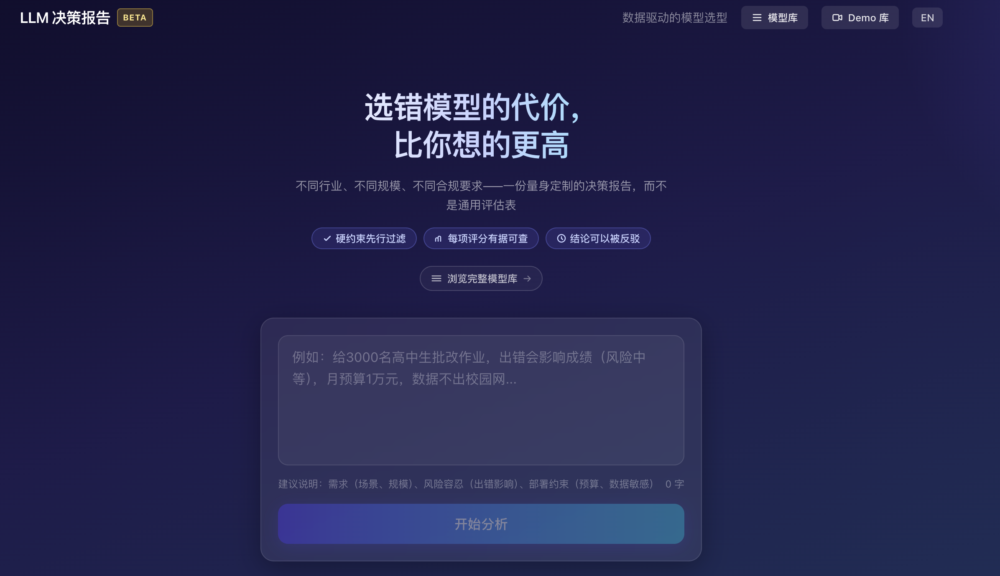
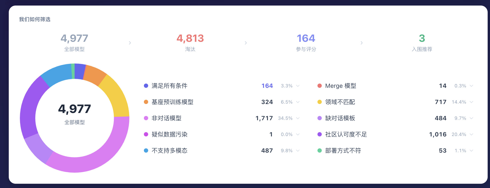
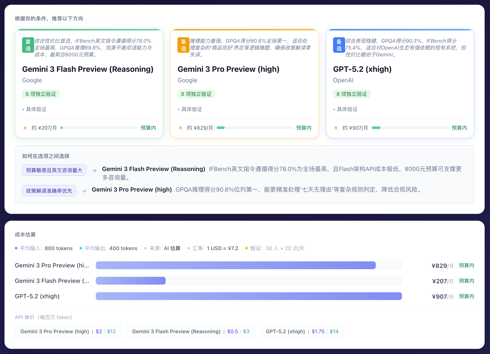
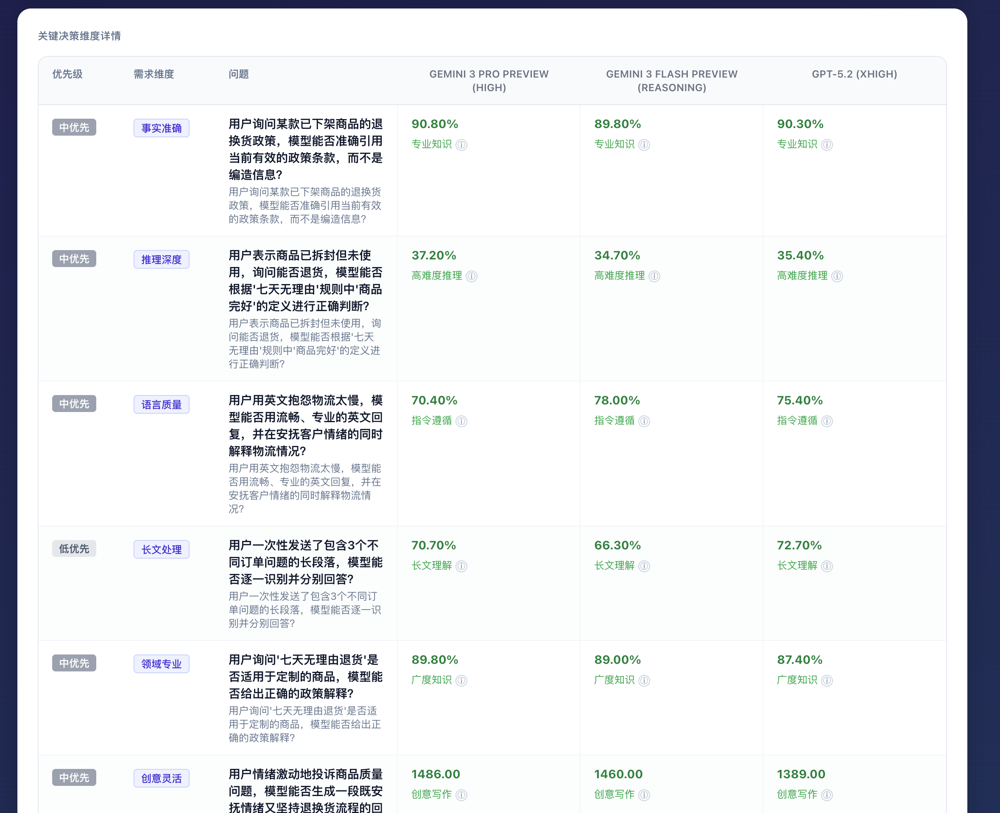

# AI 模型选型系统

> **不用再逐个试用几十个大模型——一句话描述需求，立刻拿到对比报告与选型建议。**

<p align="center">
  <a href="http://47.116.58.163:3000/">
    
  </a>
</p>

<p align="center">
  <a href="http://47.116.58.163:3000/">http://47.116.58.163:3000/</a>
</p>

---

## 📖 项目背景

面对 4800+ 的开源与商业大模型，"选哪个"本身就是一件耗时又专业的事：

- **能力维度太多**：事实准确性、推理深度、长文处理、多模态理解、领域专业性……每一项都有不同的 benchmark
- **部署约束复杂**：API 还是私有化？数据能不能出境？预算多少？是否要求开源？
- **成本难以估算**：同样一个客服场景，不同模型月成本可能差 10 倍以上

本系统把"挑模型"这件事交给模型自己：用户只需用自然语言描述一个业务场景（比如 "电商客服 50 人，日均处理 2000 条退换货咨询"），系统会自动解析需求、过滤模型、匹配证据、打分排序，最终生成一份**带决策依据的对比报告**。

## ✨ 核心功能

- 🧠 **自然语言需求抽取** — 一次 LLM 调用将场景描述解析为 7 维能力向量 + 部署约束 + 风险容忍度
- ❓ **自适应追问** — 不确定性超阈值时自动追问，最多 7 轮锁定需求
- 🔎 **多层硬过滤** — 质量门槛、模态、部署方式、数据驻留、开源要求、参数量、成本逐层筛选
- 📊 **证据驱动排名** — 基于 52 个真实 benchmark（HF Leaderboard、OpenCompass、LiveBench、Chatbot Arena 等）打分，杜绝幻觉
- 💰 **成本感知重排** — 根据 LLM 估算的 token 用量算月成本，在 shortlist 锁定前做一次软重排
- 📄 **决策报告生成** — 输出 top 3 推荐 + 决策分叉树 + 评分矩阵 + 三阶段验证路线图

## 🖼️ 产品截图

**首页：自然语言描述场景**



**过滤确认：编辑决策问题、审视候选模型**



**Shortlist：top 3 模型推荐与决策分叉**



**能力雷达：shortlist 模型多维度可视化对比**


**评分矩阵：全候选模型 × 全决策维度**



## 🛠️ 技术栈

| 类别 | 选型 |
|------|------|
| 框架 | Next.js 16（App Router）+ React 19 |
| 语言 | TypeScript |
| 样式 | Tailwind CSS v4 |
| 数据层 | Prisma + SQLite |
| LLM | Anthropic Claude |
| 数据来源 | HuggingFace Open LLM Leaderboard、OpenCompass、LiveBench、Chatbot Arena 等 |

## 🧩 系统流程

```
用户场景描述
    ↓
[1] 需求解析（LLM）    →  RequirementVector（能力向量 + 部署约束 + 风险容忍度）
    ↓
[2] 多层硬过滤          →  候选模型集
    ↓
[3] 证据匹配            →  每个模型 × 每个维度的 benchmark 分数
    ↓
[4] 能力打分 + 成本重排  →  shortlist（top 3）
    ↓
[5] 报告组装（LLM 润色） →  决策报告页
```

<p align="center">
  <a href="http://47.116.58.163:3000/">
    <b>🚀 立即体验 Demo →</b>
  </a>
</p>
